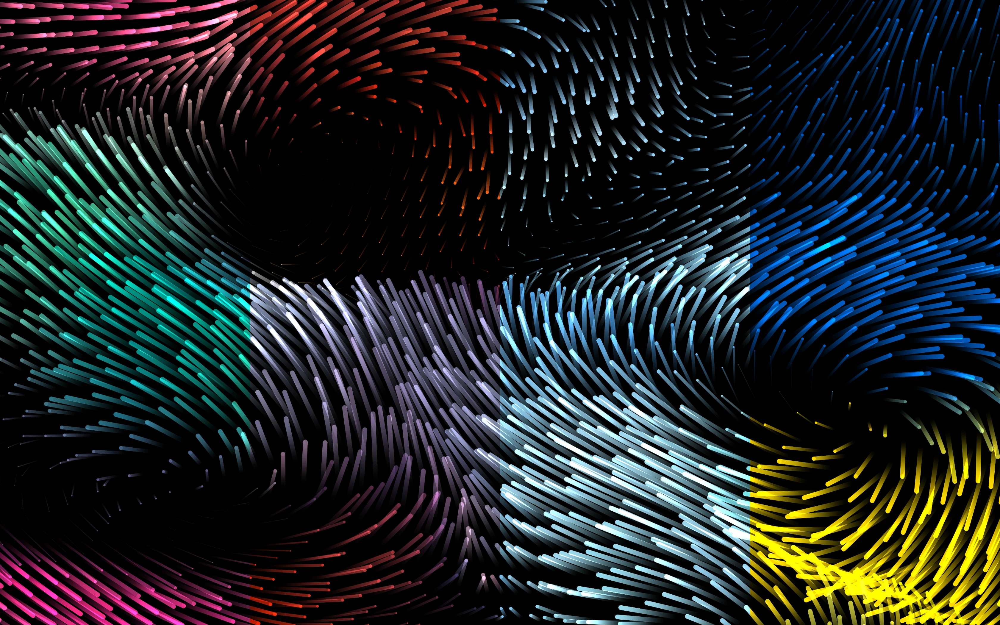
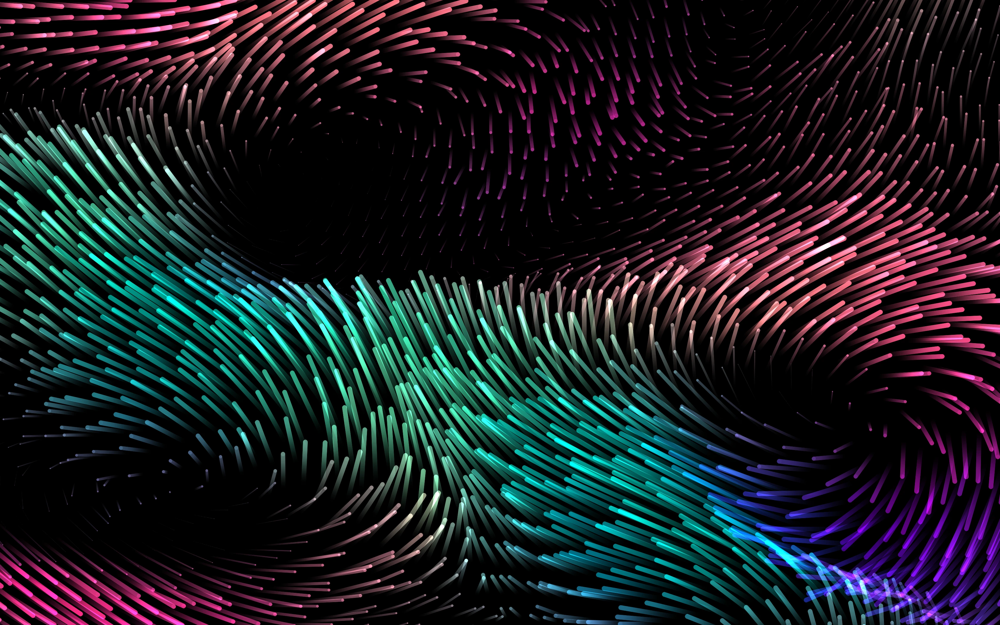
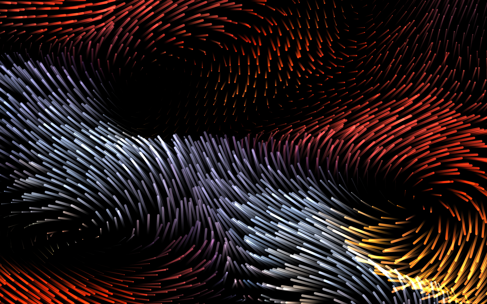
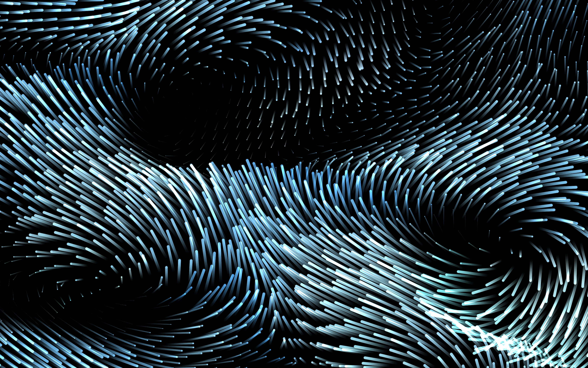
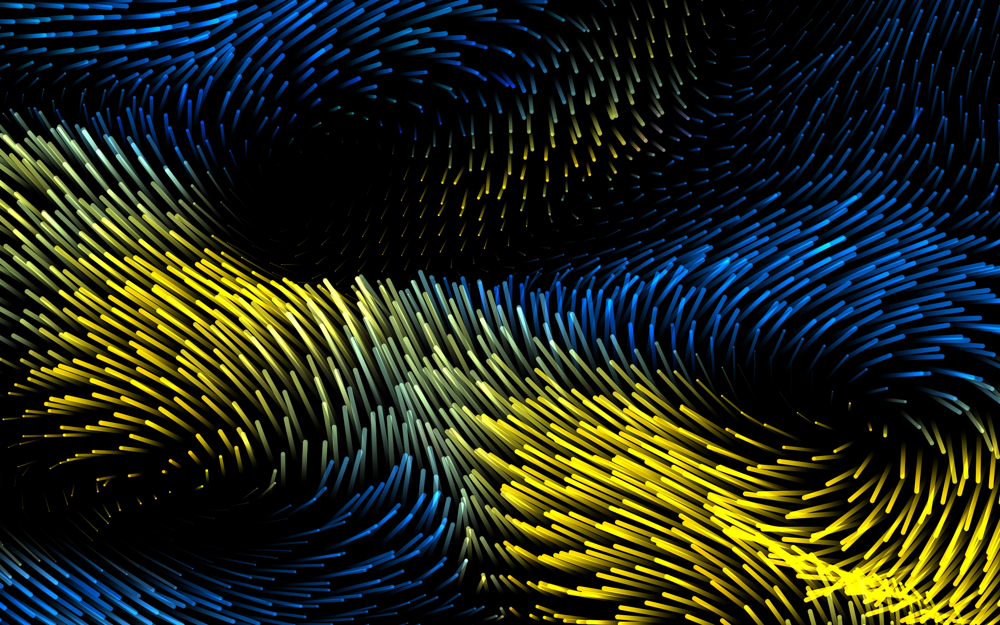

# Flux Screenshot

Save screenshots of Flux at any resolution and point in time. “Screenshot” is a misnomer though. This takes advantage of headless OpenGL, drawing to a renderbuffer without opening a window. Loosely based on one of the examples from the glutin library. Tested exclusively on macOS.

## Samples

A headless render of Flux running at a logical resolution of 1280x800px and a 2.625 scaling factor, for a final physical resolution of 3360x2100px.

